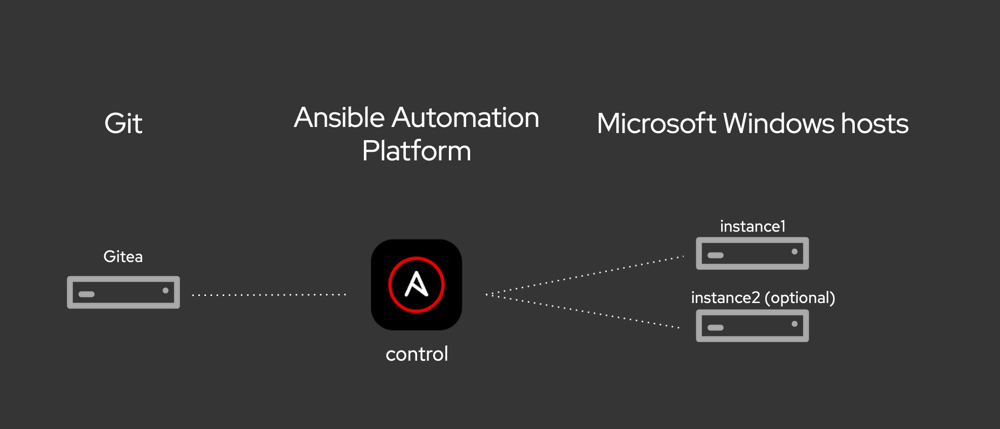

# Workshop de Automação DevOps e Windows com Ansible

**Documentação do Workshop DevOps e Windows com Ansible**

Bem-vindo ao workshop de Automação DevOps e Windows com Ansible! Este workshop prático e interativo de 3 horas é focado na automação DevOps em ambientes Windows utilizando a Red Hat Ansible Automation Platform. Ideal para desenvolvedores, administradores de sistemas e profissionais de DevOps, você aprenderá a automatizar o provisionamento de servidores Windows, deploy de aplicações e gerenciamento de serviços de TI.

## Agenda do Workshop
1. Introdução à Automação para DevOps e Windows
2. Casos de Uso e Aplicabilidade no Ambiente Windows
3. Exemplos Práticos de Automação em Pipelines DevOps em Plataformas Windows
4. Integração Contínua e Entrega Contínua (CI/CD) para Aplicações Windows
5. Laboratórios Hands-On: Automatizando Tarefas de DevOps em Windows
    * Provisionamento e Configuração de Servidores Windows
    * Deploy Automático de Aplicações Windows
    * Integração com Sistemas de CI/CD Específicos para Windows
6. Q&A

## Apresentação

Você pode encontrar o deck do apresentador aqui:
[ansible windows automation](../../decks/ansible_windows.pdf)

## Planejamento de Tempo

O tempo necessário para o workshop varia dependendo do número de participantes e da extensão das discussões. Geralmente, os exercícios devem levar cerca de 3-5 horas.

## Diagrama do Laboratório

## Exercícios

* [Exercício 1 - Introdução e Configuração do Automation Controller](1-controller)
* [Exercício 2 - Comandos Ad-Hoc em servidores windows](2-adhoc)
* [Exercício 3 - Introdução aos Playbooks](3-playbook)
* [Exercício 4 - Criando projetos e Job Templates no Automation Controller](4-projects)
* [Exercício 5 - Criando um CI](5-adv-playbook)
* [Exercício 6 - Aplicação de Patches no Windows](6-roles) (opcional)
* [Exercício 7 - Criando um CI/CD](7-win-patch) (optional)
* [Exercício 8 - Integração com Chocolatey](8-chocolatey) (opcional)
* [Exercício 9 - Fluxo de Trabalho no Windows](9-win-workflow) (optional)

